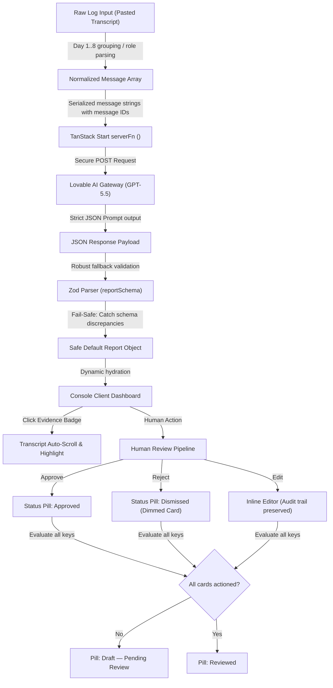

# 🤖 Coach Copilot — Weekly Client Intelligence Console

### *Artificial Intelligence Check-In Companion for 1:1 Health & Wellness Coaches*

<div align="center">
  
  <!-- Deployment Badges -->
  
  
  
  
  <br/>
  
  <!-- Tech Badges -->
  
  
  
  
  
  
  
</div>

---

> **Coach Copilot** is a GenAI-powered weekly brief client intelligence workspace. It processes raw client-coach message logs, structures them into 8-10 health dimensions, grounds every extraction in direct transcript evidence tags, and subjects them to an inline Human-in-the-Loop verification pipeline—all within a clinical, minimal design system.

---

## 🏗️ System Architecture & Data Flow

Below is the conceptual architecture of the Coach Copilot analysis and review lifecycle:



---

## 🌟 Key Capabilities & Technical Features

### 1. Robust Multiformat Transcript Parser
The parsing utility accepts raw clipboard data directly from chat platforms:
* **Group Headers:** Day markers (e.g. `Day 1` or `D1` on their own lines) define day scopes.
* **Inline Elements:** Directly parses inline formatted updates (e.g. `D3 | Accountability Coach: Steps 8,000`).
* **Sequence Indexing:** Generates coordinate tags (`D1.1`, `D2.4`) automatically for precise evidence pointing.

### 2. Evidence Grounding & Highlighting
To prevent structural hallucination, every extraction requires proof:
* **Interactive Badges:** Message index tags (e.g. `D7.3`) link to the extract's origin.
* **Auto-Focus Engine:** Clicking a badge scrolls the transcript container to the exact line and triggers a green focus ring transition to help the coach quickly audit the source material.

### 3. Human-in-the-Loop Verification Pipeline
Coaches validate AI outputs using a granular review workflow:
* **Approve:** Commits the card and updates the global check-in status.
* **Reject:** Dismisses the element, fading the visual state to ensure it is not logged.
* **Edit:** Opens an inline editor to override the AI's copy. The original AI output is preserved beneath a collapsible toggle for compliance audits.

### 4. Mutation Warning Banner
If the raw transcript is edited after a report has been generated, a warning banner alerts the coach that the report references a modified version of the transcript, preventing desynchronized check-in briefs.

---

## 📊 Visual Color Taxonomy

Extracts are badges categorized by confidence. This visual language ensures coaches never mistake AI assumptions for confirmed facts:

| Color Accent | Taxonomy Class | Meaning | Real-world Example |
| :--- | :--- | :--- | :--- |
|  **Green** | **Confirmed Fact** | Directly stated metrics and verified facts | *"Slept 8 hours last night. Weight is 83 kg."* |
|  **Blue** | **Client-Reported** | Subjective, self-reported states | *"Energy feels much better today than yesterday."* |
|  **Amber** | **AI Inference** | Extrapolated by the model based on patterns | *Office stress linked to recurrent stomach acidity.* |
|  **Grey** | **Missing** | No mention of this health dimension in the log | *No water intake mentioned. Default status applied.* |

---

## 🛡️ Hallucination & Failure Mitigations

1. **Quantification Limits:** Prompt constraints prohibit the model from inventing metrics. Dimensions without specific coordinates are marked as `missing` rather than guessed.
2. **Role Separation:** Messages are pre-processed to isolate client, coach, and accountability coach turns, keeping the model from attributing coach instructions as client achievements.
3. **Structured Fallback Schema:** Zod parser schemas validate response outputs at runtime, gracefully inserting default states if the model leaves a dimension out.

---

## 📁 JSON Schema Representation

```json
{
  "week_range": "string",
  "weekly_summary": {
    "text": "string",
    "evidence": ["string"]
  },
  "dimensions": {
    "nutrition_adherence": { "status": "string", "confidence": "confirmed_fact | client_reported | ai_inference | missing", "evidence": ["string"] },
    "exercise_steps": { "status": "string", "confidence": "...", "evidence": ["string"] },
    "sleep": { "status": "string", "confidence": "...", "evidence": ["string"] },
    "water_intake": { "status": "string", "confidence": "...", "evidence": ["string"] },
    "symptoms_stress": { "status": "string", "confidence": "...", "evidence": ["string"] },
    "engagement_level": { "status": "string", "confidence": "...", "evidence": ["string"] }
  },
  "key_barriers": [
    { "text": "string", "confidence": "string", "evidence": ["string"] }
  ],
  "pending_actions": [
    { "text": "string", "status": "open | unclear", "evidence": ["string"] }
  ],
  "risk_flags": [
    {
      "text": "string",
      "severity": "low | medium | high",
      "rationale": "string",
      "confidence": "string",
      "evidence": ["string"]
    }
  ],
  "recommended_next_action": {
    "text": "string",
    "rationale": "string",
    "evidence": ["string"]
  }
}
```

---

## ⚙️ Installation & Running Locally

### 1. Clone the Repository
```bash
git clone https://github.com/shaawtymaker/Coach-Copilot.git
cd Coach-Copilot
```

### 2. Install Dependencies
```bash
npm install
# or
bun install
```

### 3. Add Environment Key
Create a `.env` file in the root of the project:
```env
LOVABLE_API_KEY=your_lovable_api_key_here
```

### 4. Boot Dev Environment
```bash
npm run dev
# or
bun dev
```
Open your browser to `http://localhost:3000`.

### 5. Production Compilation Test
```bash
npm run build
```
